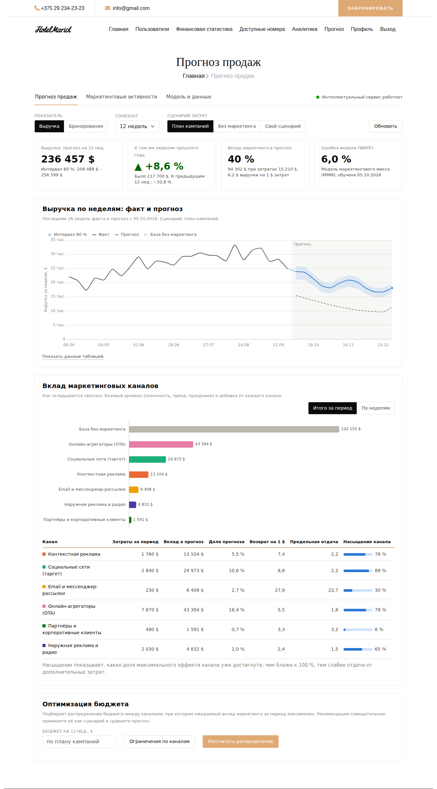

# Hotel Manager — управление номерным фондом гостиницы + прогноз продаж

Система управления гостиницей (клиент на Angular, сервер на Spring Boot, база PostgreSQL), дополненная модулем
**«Прогнозирование объёмов продаж с учётом мультиканальных маркетинговых активностей»**
(курсовой проект, тема: «Проектирование и разработка программного средства прогнозирования объёмов продаж
с учётом мультиканальных маркетинговых активностей»).

Модуль отвечает на три вопроса менеджера:

1. **Сколько мы продадим** (выручка или число бронирований) в ближайшие 4–52 недели при запланированных кампаниях — с доверительным интервалом.
2. **Что даёт каждый канал** (контекстная реклама, соцсети, рассылки, агрегаторы OTA, партнёры, наружная реклама): вклад в прогноз, возврат на 1 $, насыщение.
3. **Как лучше распределить бюджет** между каналами, и что будет, если затраты изменить («что если»).



## Состав проекта

| Каталог | Узел | Что внутри |
|---|---|---|
| `frontend/` | **клиент** | Angular 14; исходный проект + раздел «Прогноз продаж» (`src/app/views/forecast`) |
| `backend/` | **сервер** | Spring Boot 3.3.5, Java 17, PostgreSQL; исходный проект + пакет `com.HotelManager.forecast` — вся классическая бизнес-логика, авторизация, шлюз к ИИ |
| `ml-service/` | **интеллектуальный сервис** | Python 3.13, FastAPI: обучение моделей, прогноз, оптимизация бюджета. Изолирован: к основной БД доступа не имеет |
| `scripts/` | эксплуатация | скрипты запуска для Windows, шифрованные копии БД, сертификаты TLS |
| `docs/` | документация | архитектура, установка, руководство пользователя, тестирование, SQL-скрипты |

Три узла общаются только по REST: браузер → сервер → интеллектуальный сервис. Браузер с интеллектуальным
сервисом не связан; к базе данных обращается только сервер. Узлы можно разместить на разных компьютерах
(см. [руководство по установке](docs/installation-windows.md#7-размещение-узлов-на-разных-компьютерах)).

## Существующие данные не затрагиваются

Модуль **только добавляет** девять собственных таблиц (`mk_*`, `fc_*`) и заполняет их демонстрационными данными
(синтетические данные за 196 недель — реальных продаж в проекте нет). Таблицы и записи гостиничной системы
не изменяются и не читаются модулем. Проверено сравнением выгрузок `pg_dump` до и после запуска — см.
[docs/testing.md](docs/testing.md#5-проверка-что-существующие-данные-не-изменены). Удалить модуль целиком можно
скриптом [`docs/sql/forecast-drop.sql`](docs/sql/forecast-drop.sql).

## Быстрый старт (Windows 10/11)

Нужны: JDK 17+, Node.js 18/20 LTS, Python 3.11+ (лучше 3.13), PostgreSQL с базой `hotel` (как в исходном проекте).
Подробно — в [руководстве по установке](docs/installation-windows.md).

```bat
copy scripts\windows\config.example.bat scripts\windows\config.bat
rem откройте config.bat и задайте пароль БД, секрет JWT и ключи ML (в значениях не используйте & % ^ ! " < > |)

scripts\windows\1-setup-ml.bat       rem один раз: окружение Python и библиотеки
scripts\windows\start-all.bat        rem запуск трёх узлов в отдельных окнах
```

Откройте <http://localhost:4200>, войдите администратором или менеджером и выберите пункт **«Прогноз»** в меню.
Первый запуск дольше обычного: Maven и npm скачивают библиотеки, а сервер автоматически создаёт таблицы модуля,
загружает демонстрационные данные и обучает модели (около полуминуты).

Каждый узел можно запускать отдельно: `2-start-ml.bat`, `3-start-backend.bat`, `4-start-frontend.bat`.

<details>
<summary>Запуск вручную (Linux/macOS или без .bat)</summary>

```bash
# 1. интеллектуальный сервис
cd ml-service
python -m venv .venv && . .venv/bin/activate
pip install -r requirements.txt
ML_API_KEY=секрет ML_ENCRYPTION_KEY=фраза python -m app            # http://127.0.0.1:8001/docs

# 2. сервер (в другом терминале)
cd backend
sh mvnw -DskipTests package                                         # или: mvn -DskipTests package
ML_API_KEY=секрет DB_PASSWORD=пароль java -jar target/HotelManager-0.0.1-SNAPSHOT.jar   # http://localhost:8080

# 3. клиент (в третьем терминале)
cd frontend && npm ci && npm start                                  # http://localhost:4200
```
</details>

## Возможности модуля

* **Прогноз** выручки и бронирований на 4–52 недели по плану кампаний, без маркетинга или по собственному сценарию (ползунки затрат по каналам, расчёт «на лету»); интервал 80 %, сравнение с прошлым годом и предыдущим периодом.
* **Разложение прогноза**: база (сезонность, тренд, праздники) и вклад каждого канала, возврат на 1 $, предельная отдача, насыщение; для каждого графика есть таблица.
* **Оптимизация бюджета**: рекомендуемое распределение заданной суммы с ограничениями долей по каналам; рекомендацию можно применить как сценарий и сравнить прогнозы.
* **Маркетинговые активности**: справочник каналов и кампании (бюджет распределяется по дням периода равномерно).
* **Модель и данные**: сравнение алгоритмов (сезонная наивная, Хольта–Уинтерса, маркетинговый микс, градиентный бустинг), проверка точности на неизвестных модели неделях, контроль дрейфа, ввод фактических продаж и загрузка CSV, обучение и откат версий модели.
* **Устойчивость**: при недоступности интеллектуального сервиса прогноз не пропадает — показывается упрощённый (сезонность прошлого года) с пометкой «Упрощённый режим».

Архитектура, паттерны интеграции ИИ и модель данных — в [docs/architecture.md](docs/architecture.md).
Соответствие пунктам задания — в [docs/compliance.md](docs/compliance.md).

## Настройки

Все секреты задаются переменными окружения (в Windows — файлом `scripts\windows\config.bat`); значения по умолчанию годятся только для разработки.

| Переменная | Узел | Назначение | По умолчанию |
|---|---|---|---|
| `DB_PASSWORD` | сервер | пароль пользователя `postgres` | `postgres` |
| `JWT_SECRET` | сервер | секрет подписи токенов входа | значение для разработки |
| `ML_SERVICE_URL` | сервер | адрес интеллектуального сервиса | `http://localhost:8001` |
| `ML_API_KEY` | сервер и ML | общий секрет «сервер ↔ ML» (`X-API-Key`) | `dev-ml-key-change-me` |
| `ML_ENCRYPTION_KEY` | ML | парольная фраза шифрования моделей на диске | не задана (без шифрования) |
| `ML_MODELS_DIR`, `ML_HOST`, `ML_PORT` | ML | каталог моделей, адрес и порт | `models`, `127.0.0.1`, `8001` |
| `ML_SSL_CERTFILE`, `ML_SSL_KEYFILE` | ML | HTTPS (PEM) | не заданы |
| `ML_TRUST_STORE`, `ML_TRUST_STORE_PASSWORD` | сервер | хранилище PKCS12 с сертификатом ML-сервиса | не заданы, `changeit` |
| `BACKUP_PASSPHRASE` | скрипт копий | парольная фраза шифрования копий БД | запрашивается |

## Тесты

| Узел | Команда | Проверок |
|---|---|---|
| интеллектуальный сервис | `cd ml-service && pytest` | 60 |
| эксплуатационные скрипты | `ml-service/.venv/Scripts/python -m pytest scripts/tests` | 29 |
| сервер | `cd backend && sh mvnw test` (Windows: `mvnw.cmd test`; встроенная H2, основная БД не затрагивается) | 53 |
| клиент | `cd frontend && npm run test:ci` (нужен Chrome) | 47 |

Все четыре набора запускает `scripts\windows\run-tests.bat`. Подробности и результаты валидации
интеллектуального компонента — в [docs/testing.md](docs/testing.md) и [ml-service/docs/validation-report.md](ml-service/docs/validation-report.md).

## Документация

* [Руководство по установке (развёртыванию)](docs/installation-windows.md)
* [Руководство пользователя](docs/user-guide.md)
* [Архитектура, паттерны интеграции ИИ, модель данных, безопасность](docs/architecture.md)
* [Тестирование и валидация](docs/testing.md)
* [Соответствие заданию](docs/compliance.md)
* [Интеллектуальный сервис: API и алгоритмы](ml-service/README.md)
* SQL: [создание таблиц](docs/sql/forecast-schema.sql), [удаление модуля](docs/sql/forecast-drop.sql)
