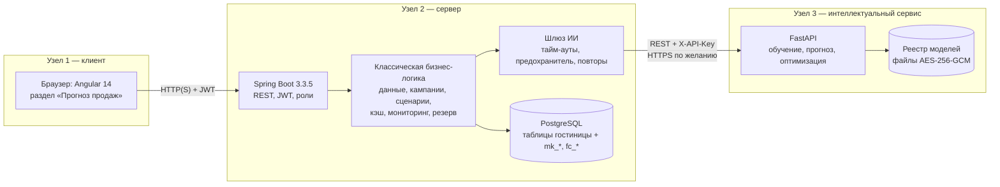
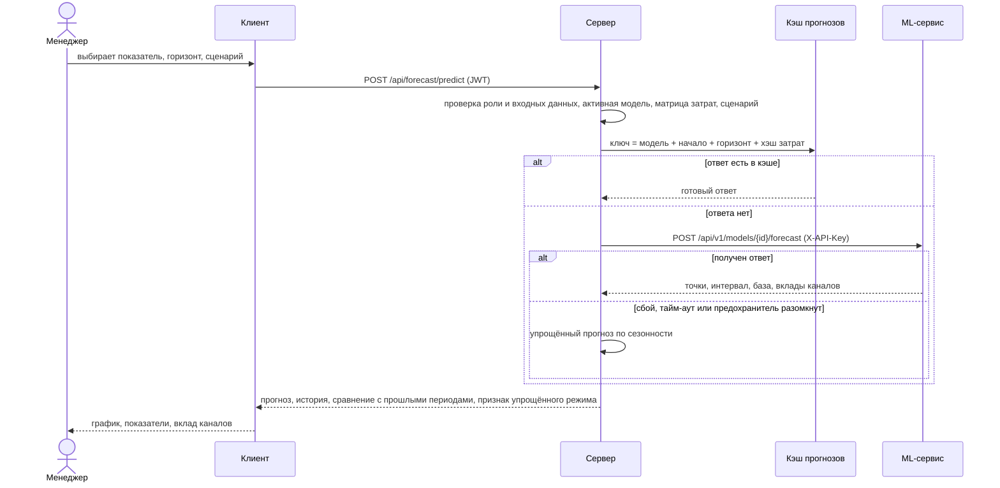
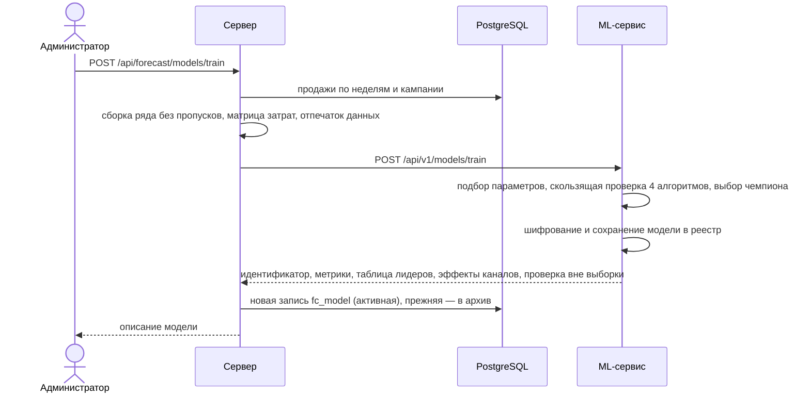
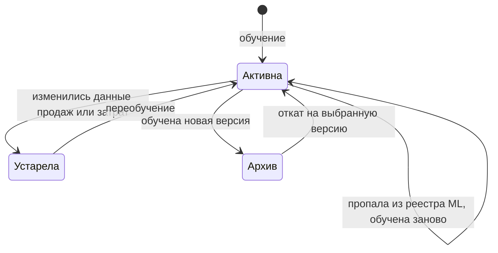
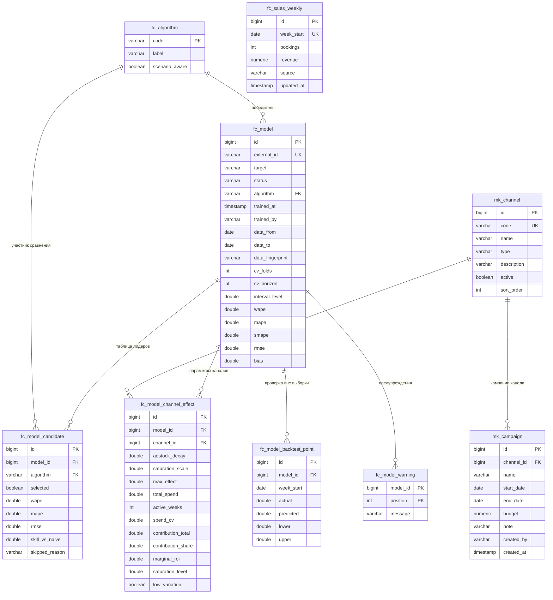

# Архитектура программного средства

Документ описывает, как модуль прогнозирования встроен в систему управления гостиницей: узлы и потоки данных,
распределение ответственности, паттерны интеграции ИИ, модель данных, интеллектуальный компонент, программные
интерфейсы и меры информационной безопасности.

Содержание: [1. Узлы](#1-узлы-и-общая-схема) · [2. Ответственность](#2-распределение-ответственности) ·
[3. Паттерны ИИ](#3-паттерны-интеграции-ии) · [4. Потоки](#4-основные-потоки) · [5. Данные](#5-модель-данных) ·
[6. Интеллектуальный компонент](#6-интеллектуальный-компонент) · [7. Интерфейсы](#7-программные-интерфейсы) ·
[8. Безопасность](#8-информационная-безопасность) · [9. Параметры](#9-параметры-устойчивости) · [10. Технологии](#10-технологии-и-версии)

## 1. Узлы и общая схема

Программное средство состоит из трёх компонентов, каждый из которых запускается отдельным процессом и может работать
на отдельном физическом узле (задание, п. 3.2.1).



| Узел | Технологии | Порт | Доступ к БД | Что хранит |
|---|---|---|---|---|
| Клиент | Angular 14, Chart.js 4 | 4200 (разработка) | нет | токен входа в браузере |
| Сервер | Spring Boot 3.3.5, Java 17, Spring Security, Resilience4j | 8080 | **единственный** | все бизнес-данные |
| Интеллектуальный сервис | Python 3.13, FastAPI, NumPy/SciPy/scikit-learn | 8001 | **нет** | зашифрованные модели на диске |

Правила взаимодействия:

* браузер обращается **только к серверу**; адрес интеллектуального сервиса клиенту неизвестен;
* интеллектуальный сервис **без состояния бизнес-данных**: сервер присылает в запросе всё, что нужно (ряд продаж, затраты по каналам), сервис возвращает результат и ничего не знает о гостях, номерах и пользователях;
* сервер вызывает сервис по REST с общим секретом `X-API-Key`; канал можно защитить TLS.

## 2. Распределение ответственности

**Классическая бизнес-логика — только на сервере** (задание, п. 3.2.1):

| Область | Где в коде (`backend/src/main/java/com/HotelManager/forecast`) |
|---|---|
| Авторизация, роли (ADMIN, MANAGER) | `config/SecurityConfig`, `@PreAuthorize` в `controller/*` |
| Справочник каналов, кампании, проверки (даты, бюджет, длительность ≤ 400 дней) | `service/ChannelService`, `service/CampaignService` |
| Фактические продажи: ввод, импорт CSV, приведение дат к понедельнику | `service/SalesHistoryService`, `service/SalesCsvParser` |
| Сборка обучающего ряда: недели, плановые затраты из кампаний (бюджет равномерно по дням), пропуски ≤ 4 недель, отпечаток данных | `service/DatasetAssembler`, `service/ForecastDataService` |
| Сценарии «план», «без маркетинга», «свой» (множители, постоянные затраты), проверка допустимых значений | `service/ForecastPlanner` |
| Прогноз: сбор запроса, кэш, обращение к сервису, упрощённый расчёт при сбое, сравнение с прошлыми периодами | `service/ForecastService`, `service/AiForecastCache`, `service/FallbackForecaster` |
| Оптимизация бюджета: бюджет, ограничения долей, подготовка применимого сценария | `service/OptimizationService` |
| Жизненный цикл моделей: реестр, активная версия, откат, устаревание | `service/ForecastModelService` |
| Контроль качества после обучения (дрейф) | `service/MonitoringService` |
| Первичное, плановое и восстановительное переобучение | `service/ModelBootstrapper`, `service/ModelRetrainScheduler` |

**Интеллектуальная составляющая — изолированный микросервис** (`ml-service/app`): подбор параметров и обучение
алгоритмов, скользящая кросс-валидация, прогноз с интервалом, разложение на вклады каналов, точное распределение
бюджета. В нём нет аутентификации пользователей, ролей и работы с БД — только вычисления по контракту API.

## 3. Паттерны интеграции ИИ

| Паттерн | Назначение | Реализация | Проверка |
|---|---|---|---|
| **Модель как сервис** (Model-as-a-Service) | Интеллект отделён от бизнес-логики, обновляется и масштабируется независимо | `ml-service/app/main.py`, `serving.py`; контракт API v1 | `ml-service/tests/test_api.py`, `HttpForecastAiGatewayTest` |
| **Шлюз / адаптер ИИ + защитный слой** (AI Gateway, Anti-Corruption Layer) | Сервер зависит от интерфейса, а не от конкретного сервиса; формат ML (snake_case) не проникает в бизнес-код | интерфейс `ai/ForecastAiGateway`, реализация `ai/HttpForecastAiGateway`, типы контракта `ai/AiContract` (за пределами пакета `ai` не используются) | `HttpForecastAiGatewayTest` — контракт, ключ, ошибки |
| **Тайм-аут + повторные попытки + предохранитель** (Timeout, Retry, Circuit Breaker) | Сбой ИИ не блокирует систему и не вызывает лавину запросов | Resilience4j, экземпляр `mlService`: окно 10 вызовов, порог отказов 50 %, пауза 15 с; 2 попытки через 300 мс; тайм-ауты соединения 2 с, вывода 8 с, обучения 5 мин | `whenAiServiceFailsForecastDegradesToFallbackAndCircuitOpens` |
| **Плавная деградация** (Graceful Degradation, Fallback) | Пользователь получает ответ, даже если ИИ недоступен | `service/FallbackForecaster`: значение той же недели прошлого года с поправкой на изменение уровня продаж, интервал ±15 %; в ответе `degraded=true`, на экране «Упрощённый режим» | `FallbackForecasterTest`, интеграционный тест деградации |
| **Кэш предсказаний** | Одинаковые запросы не нагружают ИИ | `service/AiForecastCache` (Caffeine, 10 мин); ключ = модель + начало + горизонт + хэш матрицы затрат, поэтому устаревший ответ невозможен | `identicalPredictionsAreServedFromCache` |
| **Реестр и версионирование моделей** (Model Registry) | Воспроизводимость, откат | таблица `fc_model` на сервере, каталог моделей на узле ИИ (`ml-service/app/registry.py`); смена активной версии и откат `POST /models/{id}/activate` | `retrainingActivatesNewVersionAndRollbackIsPossible` |
| **Чемпион / претендент** (Champion–Challenger) | Выбор лучшего алгоритма по данным, а не по умолчанию | `ml-service/app/training.py`: 4 алгоритма сравниваются скользящей проверкой; таблица лидеров хранится в `fc_model_candidate` и показана на экране | `ml-service/tests/test_models.py`, валидация (docs/testing.md) |
| **Непрерывное обучение** (MLOps) | Модель не стареет | `ModelBootstrapper` (при запуске), `ModelRetrainScheduler` (по понедельникам в 03:00), отпечаток данных → признак «устарела» | `ModelBootstrapperTest`, `newActualsMakeModelStaleShiftForecastOriginAndFeedMonitoring` |
| **Самовосстановление реестра** | БД перенесена или каталог моделей очищен — модель в БД есть, а в сервисе нет | `ForecastModelService.registryLost` + автоматическое переобучение при запуске и по расписанию | `lossOfModelInAiRegistryIsDetected…`, проверка на реальной БД |
| **Мониторинг дрейфа** (Model Monitoring) | Заметить, что рынок изменился | `MonitoringService`: модель прогнозирует недели, наступившие после обучения; отношение ошибки к ожидаемой ≤ 1,5 — норма, ≤ 2,5 — предупреждение, выше — переобучение | `…FeedMonitoring` |
| **Объяснимость** (Explainability) | Менеджер видит, почему прогноз такой | разложение на базу и вклады каналов (метод исключения/разложение MMM), возврат на 1 $, предельная отдача, насыщение, график проверки вне выборки | `ml-service/tests/test_intelligent_component_validation.py` |
| **Человек в контуре** (Human-in-the-loop) | Рекомендация ИИ не применяется автоматически | оптимизация даёт совет; менеджер сравнивает прогнозы и вручную «Применить как сценарий» | интерфейсные проверки |
| **Безопасное хранение моделей** | Артефакт нельзя подменить или выполнить | файлы моделей — JSON (не `pickle`), шифруются AES-256-GCM, имена проверяются на выход из каталога | `ml-service/tests/test_registry_crypto.py` |
| **Контракт и валидация входа** (Contract-first) | Мусор не доходит до вычислений | pydantic-схемы `ml-service/app/schemas.py` (диапазоны, длины, шаблоны), проверка на сервере | `ml-service/tests/test_api.py`, `invalidScenariosAndHorizonsAreRejected` |

## 4. Основные потоки

### 4.1. Прогноз



### 4.2. Обучение модели



### 4.3. Жизненный цикл модели



## 5. Модель данных

Для хранения использована реляционная СУБД PostgreSQL. Модуль **добавляет** девять таблиц и не изменяет существующие;
отношения приведены к третьей нормальной форме (задание, п. 3.2.2). DDL — [docs/sql/forecast-schema.sql](sql/forecast-schema.sql).



| Таблица | Назначение |
|---|---|
| `mk_channel` | справочник маркетинговых каналов (код, тип: платная реклама, собственные каналы, партнёры, офлайн) |
| `mk_campaign` | кампании: канал, период, бюджет; недельные затраты **вычисляются** (бюджет равномерно по дням) |
| `fc_sales_weekly` | факт продаж по неделям (бронирования, выручка), источник: демо / импорт / вручную |
| `fc_algorithm` | справочник алгоритмов: название и признак «учитывает маркетинг» |
| `fc_model` | версия модели: показатель, статус (`ACTIVE`/`ARCHIVED`), период и отпечаток обучающих данных, метрики качества |
| `fc_model_candidate` | результат каждого алгоритма-кандидата при обучении (таблица лидеров) |
| `fc_model_channel_effect` | оценённые параметры и вклад каналов в модели |
| `fc_model_backtest_point` | проверка вне выборки: факт, прогноз и интервал по неделям |
| `fc_model_warning` | предупреждения обучения (например, малая вариация затрат канала) |

**Нормализация.**

* *1НФ*: нет повторяющихся групп и составных значений; списки (кандидаты, эффекты каналов, точки проверки, предупреждения) вынесены в отдельные таблицы.
* *2НФ*: у всех таблиц, кроме `fc_model_warning`, суррогатный ключ; в `fc_model_warning` единственный неключевой атрибут `message` зависит от всего составного ключа (`model_id`, `position`).
* *3НФ*: неключевые атрибуты не зависят друг от друга. Название и свойство «учитывает маркетинг» зависят от алгоритма, а не от модели, — они вынесены в `fc_algorithm`; название канала хранится только в `mk_channel`. Производные величины не хранятся и вычисляются при чтении: недельные затраты кампаний, число недель обучающего ряда (из `data_from`, `data_to`), средние недельные затраты и возврат на 1 $ (из итогов канала).
* Оставлены как *измеренные результаты работы интеллектуального сервиса* (их нельзя вывести из других столбцов БД): метрики качества, параметры и диагностики каналов (`marginal_roi`, `saturation_level`, `low_variation`), отпечаток обучающих данных `data_fingerprint` (хэш состояния данных на момент обучения).
* Ограничения целостности: внешние ключи, `UNIQUE` на естественные ключи (`code`, `week_start`, `external_id`, `(model_id, algorithm)`, `(model_id, channel_id)`), `CHECK` на допустимые значения перечислений, неотрицательность сумм, `end_date ≥ start_date`.

Существующие таблицы системы (`users`, `roles`, `room`, `reservation`, `receipts`, `comments`, `stats`, `users_roles`) модулем не читаются и не изменяются.

## 6. Интеллектуальный компонент

Подробно — в [ml-service/README.md](../ml-service/README.md); результаты проверки — в
[ml-service/docs/validation-report.md](../ml-service/docs/validation-report.md).

**Задача**: по недельному ряду продаж и затратам по каналам предсказать продажи на 1–52 недель вперёд при заданном плане
затрат, разложить прогноз на вклады каналов и найти распределение бюджета, максимизирующее вклад маркетинга.

**Алгоритмы** (все сравниваются скользящей проверкой «окно в будущее», 4 окна по 12 недель; метрики WAPE, MAPE, sMAPE, RMSE, смещение):

| Алгоритм | Учитывает маркетинг | Роль |
|---|---|---|
| Сезонная наивная модель | нет | ориентир: «как в прошлом году» |
| Хольта–Уинтерса (ETS) | нет | классический ориентир со сглаживанием |
| **Маркетинговый микс (MMM)** | **да** | интерпретируемая модель; обычно побеждает |
| Градиентный бустинг | да | нелинейный претендент (монотонность по затратам) |

**Маркетинговый микс**:

```
y(t) = (1 + g·τ(t)) · [ b₀ + сезонные гармоники(t) + праздники(t) + Σₖ βₖ · S(Aₖ(t), kₖ) ] + ε(t)
Aₖ(t) = (1 − λₖ)·xₖ(t) + λₖ·Aₖ(t−1)        — перенос эффекта рекламы на следующие недели (adstock)
S(a, k) = 1 − exp(−a / k)                   — убывающая отдача (насыщение канала)
βₖ ≥ 0                                      — максимальный недельный эффект канала
```

Здесь `x` — недельные затраты канала, `τ` — время в годах, `g` — годовой темп роста (сезонность и отдача рекламы растут вместе с масштабом
бизнеса). Коэффициенты находятся регуляризованным методом наименьших квадратов с ограничениями (BVLS: отрицательной рекламы не бывает);
параметры `λₖ`, `kₖ`, число гармоник, сила регуляризации и `g` подбираются поиском по координатам с блочной кросс-валидацией
**только на обучающем окне**. Если вариация затрат канала мала, его вклад определяется ненадёжно — канал помечается «низкая вариация»,
и пользователь видит предупреждение.

**Выбор чемпиона**: лучший по WAPE алгоритм, *учитывающий маркетинг* (иначе нельзя строить сценарии); градиентный бустинг заменяет
MMM, только если выигрывает более 5 %.

**Интервал** прогноза — эмпирические квантили относительных ошибок проверочных окон (уровень 80 %), за пределами горизонта проверки
расширяется на 2 % за неделю. **Вклад каналов** — разложение MMM либо метод исключения («что было бы без канала»).

**Оптимизатор бюджета**: распределение заданной суммы между каналами с ограничениями долей решается точно (равенство предельных отдач
методом множителя Лагранжа с бисекцией); затраты канала не выходят за 1,5× наблюдавшегося максимума, чтобы не экстраполировать за пределы данных.

**Требования к данным**: не менее 64 недель продаж, пропуски до 4 недель заполняются интерполяцией; для маркетингового микса
служба требует ≥ 52 недель, для Хольта–Уинтерса ≥ 104 (два полных года) — иначе этот претендент пропускается с пояснением в таблице лидеров.

## 7. Программные интерфейсы

### 7.1. REST сервера (`/api/forecast/**`, заголовок `Authorization: Bearer <JWT>`)

Доступ: роли `ADMIN` и `MANAGER`; операции, помеченные «админ», — только `ADMIN`. Описание OpenAPI формирует библиотека springdoc
(`/v3/api-docs`, как и весь API, требует токен входа).

| Метод и путь | Роль | Назначение |
|---|---|---|
| `POST /predict` | менеджер | прогноз: показатель, горизонт, сценарий |
| `POST /optimize` | менеджер | распределение бюджета: сумма и ограничения долей |
| `GET /status` | менеджер | состояние интеллектуального сервиса, моделей и данных |
| `GET /channels` | менеджер | список каналов |
| `POST /channels`, `PUT /channels/{id}`, `DELETE /channels/{id}` | админ | управление справочником |
| `GET /campaigns`, `GET /campaigns/{id}` | менеджер | кампании с фильтрами и постраничным выводом |
| `POST /campaigns`, `PUT /campaigns/{id}`, `DELETE /campaigns/{id}` | менеджер | управление кампаниями |
| `GET /sales`, `PUT /sales` | менеджер | продажи по неделям: просмотр, ввод/исправление |
| `DELETE /sales/{weekStart}`, `POST /sales/import` | админ | удаление недели, загрузка CSV |
| `GET /models`, `GET /models/{id}` | менеджер | реестр и подробности модели |
| `GET /models/{id}/monitoring` | менеджер | контроль точности на новых неделях |
| `POST /models/train`, `POST /models/{id}/activate` | админ | обучение, переключение версии |

Ошибки возвращаются в формате `{"status": <код>, "message": "<текст на русском>", "timestamp": ...}`: 400 — неверные данные, 401 — нет входа, 403 — нет прав,
404 — не найдено, 409 — конфликт (например, модель ещё не обучена), 422 — отклонено интеллектуальным сервисом, 503 — сервис недоступен.

### 7.2. REST интеллектуального сервиса (`/api/v1`, заголовок `X-API-Key`)

| Метод и путь | Назначение |
|---|---|
| `POST /models/train` | обучение: каналы, ряд продаж, матрица затрат, параметры проверки |
| `GET /models`, `GET /models/{id}` | реестр моделей, подробности (также проверка наличия модели) |
| `POST /models/{id}/forecast` | прогноз по матрице затрат, с вкладами каналов |
| `POST /models/{id}/optimize` | распределение бюджета |
| `GET /health` (без ключа) | состояние, версия, признак шифрования |

Интерактивное описание — `http://localhost:8001/docs`.

## 8. Информационная безопасность

Соответствие пунктам 3.4.1–3.4.2 задания.

| Угроза | Мера | Где |
|---|---|---|
| Подбор/кража пароля из БД | пароли хранятся в виде хэшей **BCrypt** (исходная система) | `users.password` |
| Несанкционированный доступ к модулю | вход по JWT; роли `ADMIN`/`MANAGER` для `/api/forecast/**` проверяются на уровне URL и методов; клиентский маршрут защищён охранником; недействительный токен даёт 401, а не 500 | `SecurityConfig`, `JwtRequestFilter`, `StaffGuard` |
| Вызов интеллектуального сервиса в обход сервера | общий секрет `X-API-Key`, сравнение за постоянное время; сервис слушает `127.0.0.1` по умолчанию | `ml-service/app/security.py` |
| Перехват данных между узлами | **HTTPS (TLS)** между сервером и сервисом: самоподписанный сертификат (`scripts/make_certs.py`), сервер доверяет только своему хранилищу PKCS12 | `ML_SSL_*`, `ML_TRUST_STORE`; проверено на реальных процессах: с хранилищем работает, без него соединение отклоняется |
| Кража или подмена файлов моделей | шифрование **AES-256-GCM** (ключ из парольной фразы PBKDF2-SHA256, 200 000 итераций); тег аутентификации выявляет изменение; формат JSON без `pickle`, поэтому файл нельзя использовать для выполнения кода | `ml-service/app/crypto.py`, `registry.py` |
| Потеря/кража резервных копий БД | **шифрованные копии** AES-256-GCM (ключ из парольной фразы scrypt), потоковое шифрование без промежуточных открытых файлов, проверка целостности, восстановление в новую БД одной транзакцией; режим «только таблицы модуля» | `scripts/db_backup.py` |
| Внедрение через входные данные | строгая валидация на обоих узлах (диапазоны, длины, шаблоны кодов), параметризованные запросы JPA, ограничение размера CSV (1 МБ, 2000 строк) и тела запроса к ИИ (10 МБ) | `ForecastExceptionHandler`, `schemas.py` |
| Выход за каталог при обращении к модели | идентификатор модели проверяется по шаблону | `registry.py` |
| Утечка секретов в репозиторий | секреты — только переменные окружения; файл `scripts/windows/config.bat`, каталоги `certs/` и `backups/`, ключи и модели в `.gitignore` | `.gitignore` |
| Отказ ИИ-узла | тайм-ауты, предохранитель, упрощённый режим (раздел 3) | `HttpForecastAiGateway` |

**Ограничения и рекомендации для эксплуатации.** Канал «браузер — сервер» в учебной конфигурации работает по HTTP: для
эксплуатации поставьте перед сервером и клиентом обратный прокси (nginx, Caddy, IIS) с HTTPS. Шифрование диска (BitLocker)
защитит файлы PostgreSQL, которые сама СУБД не шифрует. Секреты по умолчанию (`dev-ml-key-change-me`, пароль БД) годятся
только для разработки; при запуске без `config.bat` скрипты предупреждают об этом.

## 9. Параметры устойчивости

Задаются в `backend/src/main/resources/application.properties` (или переменными окружения).

| Параметр | Значение | Смысл |
|---|---|---|
| `forecast.ai.connect-timeout` / `inference-timeout` / `training-timeout` | 2 с / 8 с / 5 мин | время ожидания соединения, прогноза, обучения |
| `resilience4j.circuitbreaker.instances.mlService.*` | окно 10, минимум 4 вызова, порог 50 %, пауза 15 с | предохранитель |
| `resilience4j.retry.instances.mlService.*` | 2 попытки, пауза 300 мс | повторы при недоступности |
| `forecast.cache.ttl` / `max-size` | 10 мин / 200 | кэш прогнозов |
| `forecast.bootstrap.train-on-startup` | `true` | первичное и восстановительное обучение при старте (повтор каждые 30 с, до 20 раз, пока сервис недоступен) |
| `forecast.retrain.cron` | `0 0 3 * * MON` | плановое переобучение при изменении данных или потере модели |
| `forecast.demo-data.enabled` | `true` | загрузить демонстрационные данные в пустые таблицы модуля |

## 10. Технологии и версии

| Узел | Компонент | Версия |
|---|---|---|
| Интеллектуальный сервис | Python | 3.13 |
| | FastAPI / Uvicorn / Pydantic | 0.128.0 / 0.40.0 / 2.12.5 |
| | NumPy / SciPy / pandas | 2.4.2 / 1.17.0 / 3.0.0 |
| | scikit-learn / statsmodels | 1.8.0 / 0.14.6 |
| | cryptography | 46.0.4 |
| Сервер | Java / Spring Boot | 17 / 3.3.5 (исходный проект) |
| | Resilience4j / Caffeine | 2.3.0 / 3.1.8 |
| | PostgreSQL | 12 и новее (проверено на 16) |
| Клиент | Angular / TypeScript | 14.2 / 4.8 (исходный проект) |
| | Chart.js | 4.5.1 (подключён локально, без CDN) |

Версии новых частей выбраны по состоянию на январь 2026 года. Исходный проект гостиничной системы (Angular 14, Spring Boot 3.3.5)
не обновлялся, чтобы не затрагивать работающий функционал; перечень отличий от версий января 2026 года — в [compliance.md](compliance.md).
