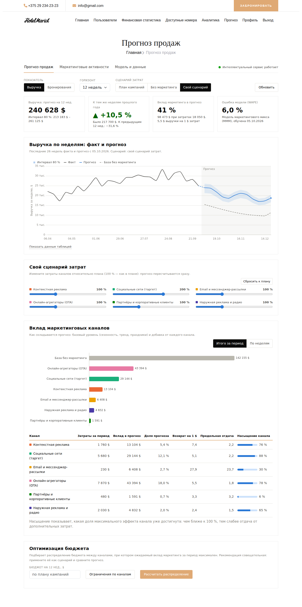
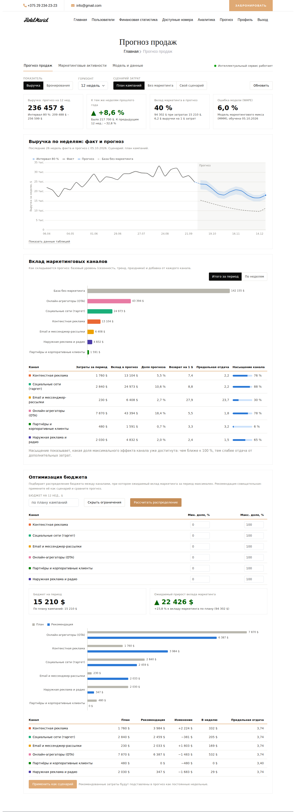
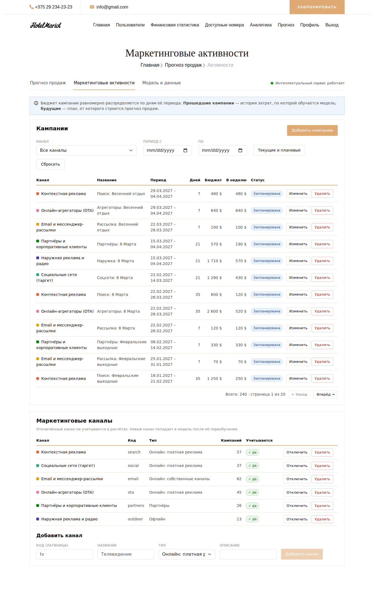
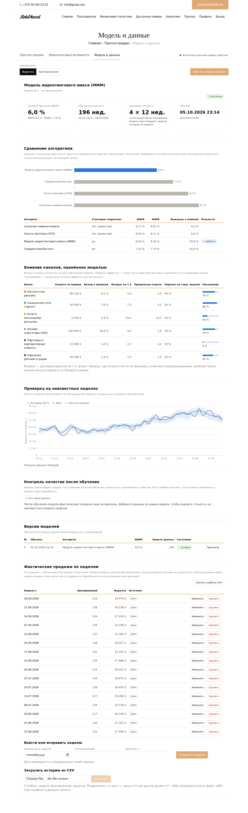
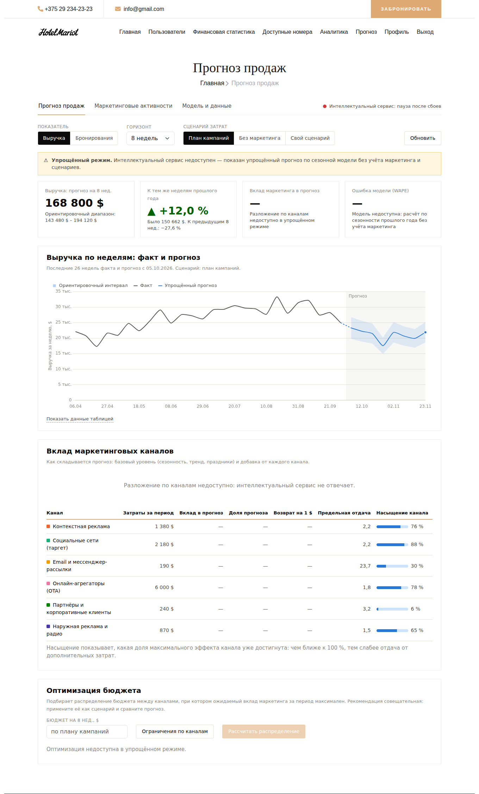

# Руководство пользователя

Руководство описывает работу с разделом **«Прогноз продаж»** гостиничной системы. Остальные разделы системы (поиск и бронирование номеров,
профиль, аналитика) работают, как прежде.

Содержание: [1. Роли и доступ](#1-роли-и-доступ) · [2. Вход и навигация](#2-вход-и-навигация) ·
[3. Прогноз продаж](#3-страница-прогноз-продаж) · [4. Маркетинговые активности](#4-страница-маркетинговые-активности) ·
[5. Модель и данные](#5-страница-модель-и-данные) · [6. Типовые задачи](#6-типовые-задачи) ·
[7. Как читать результаты](#7-как-читать-результаты) · [8. Словарь](#8-словарь-терминов) · [9. Вопросы и ответы](#9-вопросы-и-ответы)

## 1. Роли и доступ

| Категория пользователя | Доступ к разделу «Прогноз» | Что может делать |
|---|---|---|
| Гость / пользователь | **нет** (пункта меню нет, прямая ссылка возвращает на главную) | пользуется остальными функциями системы |
| Менеджер | да | прогноз и сценарии, оптимизация бюджета, кампании, ввод продаж за неделю, просмотр моделей и контроля качества |
| Администратор | да, полный | всё, что менеджер, а также справочник каналов, загрузка истории из CSV, удаление недель, обучение модели и выбор её версии |

## 2. Вход и навигация

1. Откройте адрес клиентской части (по умолчанию <http://localhost:4200>) и войдите под своей учётной записью.
2. В верхнем меню выберите **«Прогноз»**. Раздел состоит из трёх вкладок:
   * **Прогноз продаж** — главная панель;
   * **Маркетинговые активности** — кампании и каналы;
   * **Модель и данные** — качество модели, история продаж, обучение.
3. Справа от вкладок всегда виден индикатор **интеллектуального сервиса**:
   * зелёный — «работает»;
   * красный — «недоступен — упрощённый режим» или «пауза после сбоев» (система продолжает работать, см. раздел 6.5).

## 3. Страница «Прогноз продаж»


### 3.1. Параметры расчёта (верхняя строка)

| Элемент | Назначение |
|---|---|
| **Показатель** | «Выручка» (в долларах) или «Бронирования» (штуки) |
| **Горизонт** | на сколько недель вперёд считать: 4, 8, 12, 26 или 52 |
| **Сценарий затрат** | «План кампаний» — затраты берутся из внесённых кампаний; «Без маркетинга» — на весь период прогноза затраты равны нулю (реклама, оплаченная раньше, ещё какое-то время действует, поэтому прогноз остаётся немного выше «базы без маркетинга»); «Свой сценарий» — вы меняете затраты каналов вручную |
| **Обновить** | пересчитать (прогноз пересчитывается и сам при каждом изменении параметров) |

### 3.2. Четыре показателя

1. **Прогноз на выбранный период** и его интервал: с вероятностью 80 % фактическое значение окажется внутри указанного диапазона.
2. **К тем же неделям прошлого года** (зелёная ▲ — рост, красная ▼ — падение) и к предыдущему периоду той же длины.
3. **Вклад маркетинга в прогноз**: какая доля прогноза получена благодаря рекламе, сколько это в деньгах и сколько долларов выручки приносит
   каждый вложенный доллар.
4. **Ошибка модели (WAPE)**: насколько в среднем модель ошибалась на неделях, которых не видела. 6 % означает отклонение порядка 6 % от факта.

### 3.3. График «факт и прогноз»

Серая линия — фактические продажи за последние 26 недель, синяя — прогноз, голубая полоса — интервал 80 %, пунктир — **база без маркетинга**
(что продавалось бы без рекламы: сезонность, тренд, праздники). Расстояние между синей линией и пунктиром — вклад рекламы.
Наведите курсор на график — появится подсказка с значениями недели и вертикальная направляющая. Под графиком кнопка **«Показать данные
таблицей»** раскрывает те же числа таблицей (удобно копировать в отчёт).

### 3.4. Вклад маркетинговых каналов

Столбцы показывают, из чего состоит прогноз: база и добавка от каждого канала; переключатель **«Итого за период» / «По неделям»** меняет вид.
Таблица ниже для каждого канала содержит:

| Столбец | Смысл |
|---|---|
| Затраты за период | сумма затрат канала на выбранном горизонте по текущему сценарию |
| Вклад в прогноз | сколько выручки (бронирований) прогноза обеспечивает канал |
| Доля прогноза | вклад канала, делённый на весь прогноз |
| Возврат на 1 $ | вклад / затраты за период (для бронирований — на 1000 $) |
| Предельная отдача | сколько дополнительной выручки даст следующий доллар затрат при текущем уровне — **главный показатель для решения, увеличивать ли бюджет** |
| Насыщение канала | какая доля максимального эффекта канала уже достигнута; чем ближе к 100 %, тем слабее отдача от новых вложений |

### 3.5. Свой сценарий

Выберите **«Свой сценарий»**: для каждого канала появится ползунок затрат относительно плана (100 % — как в плане, 0 % — отключить, максимум 300 %).
Прогноз пересчитывается сразу; **«Сбросить к плану»** возвращает исходные значения.



### 3.6. Оптимизация бюджета

Блок подбирает распределение бюджета между каналами, при котором ожидаемый вклад маркетинга за период максимален.

1. Укажите **бюджет** (пусто — взять сумму по плану кампаний на этом горизонте).
2. При необходимости откройте **«Ограничения по каналам»** и задайте минимальную и максимальную долю канала в процентах (например, не менее 20 % на агрегаторы).
3. Нажмите **«Рассчитать распределение»**.



Результат: ожидаемый прирост вклада маркетинга относительно плана, столбцы «План» и «Рекомендация» по каналам, таблица с изменением и
рекомендуемыми затратами в неделю. **Рекомендация совещательная**: она рассчитана по модели и не вносится в кампании сама. Кнопка
**«Применить как сценарий»** подставляет рекомендованные затраты в прогноз (как постоянные недельные затраты), чтобы вы сравнили картину
с планом, прежде чем менять кампании.

Рекомендация не выходит за пределы, в которых модель видела данные (затраты канала не более 1,5× от наблюдавшегося максимума),
и недоступна в упрощённом режиме.

## 4. Страница «Маркетинговые активности»



### 4.1. Кампании

Кампания — это бюджет канала на период. Система распределяет бюджет **равномерно по дням** периода и суммирует по неделям; эти недельные
затраты и есть «план кампаний» для прогноза.

* **Добавить кампанию**: выберите канал, введите название, даты начала и окончания (не более 400 дней), бюджет за весь период и, при желании, примечание → **«Сохранить»**.
* **Изменить / Удалить** — кнопки в строке таблицы. Статус («Запланирована», «Идёт», «Завершена») определяется по датам.
* Фильтры: канал, период; кнопка **«Текущие и плановые»** показывает кампании, которые ещё не завершились. Таблица постраничная.

Внесённые затраты за прошедшие недели учитываются как факт, за будущие — как план. После изменения кампаний прогноз пересчитывается; модель
помечается «устарела» — её стоит переобучить (раздел 5).

### 4.2. Каналы

Справочник каналов: контекстная реклама, соцсети, рассылки, агрегаторы (OTA), партнёры, наружная реклама. Администратор может добавить
канал (латинский код, название, тип), отключить (канал перестаёт учитываться) или удалить — удаление возможно, пока на канал не ссылаются
кампании и обученные модели; иначе используйте «Отключить». Новый канал попадает в прогноз после переобучения модели.

## 5. Страница «Модель и данные»



Выберите показатель («Выручка» или «Бронирования») — страница покажет его активную модель.

* **Карточка модели**: алгоритм-победитель, ошибка WAPE (а также MAPE и RMSE), число недель обучения и их границы, схема проверки (4 окна по 12 недель),
  дата обучения и признак **«актуальна» / «устарела»** (данные изменились после обучения).
* **Сравнение алгоритмов**: четыре алгоритма проверены на одних и тех же неделях; выбирается лучший из тех, что учитывают маркетинг (иначе нельзя
  строить сценарии). «Выигрыш к наивной» показывает, на сколько ошибка меньше, чем у простого повторения прошлого года.
* **Влияние каналов, оценённое моделью**: затраты, вклад, возврат на 1 $, предельная отдача, «перенос на следующую неделю» (какая часть
  действия рекламы сохраняется) и насыщение. Значок **«⚠ мало данных»** означает, что затраты канала почти не менялись и его вклад нельзя
  надёжно отделить от базового уровня — доверять такой оценке не стоит.
* **Проверка на неизвестных неделях**: прогноз модели против факта на последних неделях, которых она не видела при обучении.
  Чем ближе линии и чем чаще факт попадает в полосу, тем надёжнее модель.
* **Контроль качества после обучения**: модель прогнозирует недели, наступившие после обучения, и результат сравнивается с фактом. Статусы:
  «Точность в норме», «Точность снизилась» (рекомендуется переобучить), «Требуется переобучение», «Мало данных для оценки» (нужно ≥ 4 новых недель).
* **Версии моделей**: хранится история; **«Просмотр»** показывает прежнюю версию, администратор может сделать её активной (откат).

### 5.1. Фактические продажи

Таблица содержит обучающий ряд: бронирования и выручку по неделям (неделя начинается в понедельник).

* **Внести или исправить неделю**: любая дата недели (приводится к понедельнику), бронирования, выручка → **«Сохранить неделю»**.
* **Загрузить историю из CSV** (администратор): файл с тремя столбцами **неделя; бронирования; выручка**. Разделитель — «;» или «,», даты —
  `гггг-мм-дд` или `дд.мм.гггг`, дробная часть — точка или запятая, строка заголовка необязательна. Кнопка **«Скачать шаблон CSV»** даёт образец.

  ```
  неделя;бронирования;выручка
  05.10.2026;118;25430,50
  12.10.2026;121;26110
  ```

  Загружается либо весь файл, либо — если в данных есть ошибки — ничего; сообщение укажет номера строк. Существующие недели обновляются.
* **Удалить** (администратор) — убирает неделю из ряда.

Внесённые данные хранятся только в таблицах модуля; данные бронирований и чеков основной системы не используются и не изменяются.
Для обучения нужно **не менее 64 недель** истории, пропуски до 4 недель подряд заполняются автоматически.

### 5.2. Обучение (администратор)

Кнопка **«Обучить модель заново»** запускает обучение на текущих данных (занимает несколько секунд). Новая версия становится активной,
предыдущая уходит в архив. Модели обучаются автоматически при запуске системы, по понедельникам в 03:00 (если данные изменились) и
после потери модели (например, при переносе базы на другой компьютер).

## 6. Типовые задачи

### 6.1. Оценить выручку следующего квартала

Панель «Прогноз продаж» → Показатель «Выручка» → Горизонт «12 недель» → «План кампаний». Прогноз и интервал — в первом показателе. Если
кампаний на весь квартал ещё нет, прогноз будет осторожным: незапланированные недели считаются неделями без рекламы.

### 6.2. Узнать, что даст усиление соцсетей на 50 %

«Свой сценарий» → ползунок «Социальные сети» на 150 % → сравните итог с планом (показатель 1 и разница на графике). Обратите внимание на
насыщение канала: если оно высокое, прирост будет небольшим.

### 6.3. Распределить бюджет 20 000 $ на квартал

Блок «Оптимизация бюджета» → бюджет 20000 → при необходимости ограничения → «Рассчитать распределение» → «Применить как сценарий» → проверьте прогноз →
внесите кампании по рекомендованным суммам на вкладке «Маркетинговые активности».

### 6.4. Обновить данные и модель

«Модель и данные» → внесите продажи за прошедшие недели → модель отмечена «устарела» → администратор нажимает «Обучить модель заново» →
проверьте блок «Контроль качества после обучения».

### 6.5. Если индикатор красный (упрощённый режим)

Интеллектуальный сервис временно недоступен. Система не прекращает работу: показывается **упрощённый прогноз** — значения тех же недель прошлого года
с поправкой на изменение уровня продаж и приблизительным интервалом ±15 %. В этом режиме нет разложения по каналам, сценарии «без маркетинга» и
«свой» не влияют на результат, оптимизация недоступна. Обратитесь к администратору: нужно запустить интеллектуальный сервис (`2-start-ml.bat`).
Через несколько секунд после восстановления сервиса индикатор станет зелёным, а расчёты — полноценными.



## 7. Как читать результаты

* **Интервал — это не гарантия.** Он построен по ошибкам модели на прошлых неделях; 80 % недель укладываются в него. Чем дальше горизонт, тем шире интервал.
* **Корреляция не равна причинности.** Модель оценивает вклад каналов по тому, как менялись продажи при изменении затрат. Если затраты канала почти не
  менялись (предупреждение «⚠ мало данных»), или несколько каналов всегда включались вместе, их вклады нельзя разделить уверенно.
* **Предельная отдача важнее средней.** Канал с высоким «Возвратом на 1 $», но высоким насыщением уже почти не даст прироста от дополнительных вложений.
* **Рекомендация — совет.** Оптимизатор не знает о договорённостях, ограничениях площадок и качестве аудитории; решение принимает человек.
* **Демонстрационные данные.** При первом запуске модуль заполнен синтетическими данными: по ним удобно знакомиться с программой, но не принимать
  решения. Для работы с реальными данными администратор задаёт перед первым запуском переменную окружения `FORECAST_DEMODATA_ENABLED=false`
  (таблицы создаются пустыми), вносит свои каналы, кампании и историю продаж (раздел 5.1) и обучает модель. Если демонстрационные данные уже созданы,
  таблицы модуля можно удалить скриптом `docs/sql/forecast-drop.sql` и запустить сервер заново с этой переменной (см. руководство по установке).
* Если модель помечена **«устарела»** или контроль качества показывает рост ошибки, переобучите её.

## 8. Словарь терминов

| Термин | Пояснение |
|---|---|
| WAPE | взвешенная средняя абсолютная ошибка: сумма \|факт − прогноз\| / сумма факта; меньше — лучше |
| MAPE / RMSE | средняя абсолютная процентная ошибка / среднеквадратичная ошибка (в единицах показателя) |
| Интервал 80 % | диапазон, в который с вероятностью около 80 % попадёт факт |
| База без маркетинга | продажи, которые были бы совсем без рекламы (включая действие ранее оплаченной): сезонность, тренд, праздники |
| Вклад канала | часть прогноза, обеспеченная каналом (по модели) |
| Возврат на 1 $ (ROI) | вклад канала / его затраты |
| Предельная отдача | прирост показателя от дополнительного доллара затрат при текущем уровне |
| Насыщение | доля максимального эффекта канала, уже достигнутая; дальше отдача падает |
| Перенос эффекта (adstock) | часть действия рекламы, сохраняющаяся на следующую неделю |
| Скользящая проверка | модель обучается на прошлом и проверяется на следующих неделях, которых не видела; так несколько раз |
| Сезонная наивная модель | «как в то же время прошлого года»: ориентир, с которым сравниваются остальные |
| Упрощённый режим | расчёт по сезонности прошлого года без обращения к интеллектуальному сервису |
| Дрейф | изменение условий рынка, из-за которого модель становится менее точной |

## 9. Вопросы и ответы

**Раздел «Прогноз» не отображается в меню.** Он доступен только администратору и менеджеру; войдите под такой учётной записью.

**Пишет «Модель для показателя … ещё не обучена».** Администратор должен обучить модель на странице «Модель и данные» (нужно ≥ 64 недель данных).

**Прогноз не меняется при изменении ползунков.** Это упрощённый режим: интеллектуальный сервис недоступен (красный индикатор).

**Прогноз на 12 недель считается быстро, а потом «зависает».** Первые обращения после запуска могут занять несколько секунд; если индикатор красный — см. раздел 6.5.

**Почему вклад маленького канала получился нулевым?** Для каналов с малыми или почти постоянными затратами модель не может отделить эффект от
базового уровня и ограничивает вклад нулём (отрицательной рекламы не бывает); смотрите предупреждение «⚠ мало данных».

**Можно ли использовать данные бронирований системы?** В текущей версии модуль работает с отдельным рядом продаж (таблица `fc_sales_weekly`),
чтобы не затрагивать данные основной системы; загрузите историю из CSV или вносите недели вручную.
